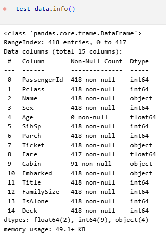

# Titanic- Machine Learning from Disaster
### Project Overview
The Projects is a competition from Kaggle which uses machine learning to create a model that predicts which passengers survived the Titanic shipwreck.
I am not specifying details about dataset, goals, overview in this repo but you can find those details here: [Kaggle Titanic Competition](https://www.kaggle.com/competitions/titanic)

### How to Replicate
1. Clone the repository: `git clone <repo-link>`
2. Install dependencies
3. Run the main notebook/script

### Overview of My Approach
#### Feature Selection & Pre-processing

To predict the missing 'Age' values, a specific set of features was selected. These features were chosen for their potential correlation with a passenger's age.

- Number of passengers with known age: 1046
- Number of passengers with missing age: 263

These features will be used to PREDICT age

imputation_features = ['Pclass', 'SibSp', 'Parch', 'Fare', 'Title', 'FamilySize']

Note: FamilySize: Created a FamilySize feature by combining SibSp and Parch (FamilySize = SibSp + Parch + 1) to represent the total number of family members for each passenger.

Selected Features:

- Pclass: Ticket class
- SibSp: Number of siblings/spouses aboard
- Parch: Number of parents/children aboard
- Fare: Passenger fare
- Title: Passenger's title (e.g., Mr, Mrs, Miss)
- FamilySize: The total count of family members aboard (derived from SibSp and Parch)

Before training the model, a necessary pre-processing step was performed on the Fare feature.

Missing 'Fare' Values: Any missing values in the Fare column were filled with the median fare of all passengers. This ensures the feature can be used in the regression model without issues.
#### Data Preparation

The dataset was split into two subsets to train the age prediction model:

Training Set: Consists of passengers where the 'Age' is known. The imputation_features were used as the input (X_age_train), and the 'Age' column served as the target (y_age_train).

Prediction Set: Consists of passengers with missing 'Age' values. The imputation_features from this set (X_age_predict) were used to predict their ages.
#### Model Training and Imputation

A regression model was trained to handle the imputation task.

Model: A RandomForestRegressor was chosen for this task, configured with 200 estimators.

Training: The model was trained on the X_age_train and y_age_train data.

Imputation: The trained regressor was then used to predict the ages for the X_age_predict dataset, effectively filling in the missing 'Age' values.

#### Feature Engineering

A numerical 'Deck' feature was engineered from the 'Cabin' column to capture the general location of a passenger's cabin.

1. Deck Creation: A new feature, Deck, was created by extracting the first letter from the Cabin feature. This letter often corresponds to the deck level on the ship.
2. Handling Missing Values: For passengers with a missing 'Cabin' value, the 'Deck' was assigned the letter 'U' for 'Unknown'.

3. Numerical Mapping: The categorical 'Deck' letters were converted into numerical values. This makes the feature suitable for use in machine learning models. The following mapping was applied:

deck_mapping = {"A": 1, "B": 2, "C": 3, "D": 4, "E": 5, "F": 6, "G": 7, "T": 8, "U": 0}

### Verifying the Features  

#### Models
* Logistic Regression
* Random Forest Classifier (with and without Grid Search for hyperparameter tuning)
* Support Vector Machine (SVM) (with and without Grid Search for hyperparameter tuning)
* Decision Tree Classifier

* XGBoost Classifier (with and without hyperparameter tuning)

Ensemble Methods:

Voting Classifier (combining Logistic Regression, Random Forest, SVM, and Decision Tree)

Champion Ensemble (combining optimized Random Forest, SVM, and XGBoost)

#### Evaluation Metrics
The performance of each model was assessed using the following metrics:

- Accuracy: This measures the proportion of correctly predicted survivals and fatalities.

- Classification Report: This provides a more detailed breakdown of performance, including precision, recall, and F1-score for each class (survived vs. not survived).

### Results
The performance of the various models was evaluated using accuracy from local cross-validation, with the final submission score reflecting performance on the unseen test set.

| Model                    | Accuracy |
| ------------------------ | -------- |
| RFC Grid Search          | 0.837989 |
| RFC Advanced Grid Search | 0.837989 |
| Voting Classifier        | 0.832402 |
| Adv Voting Classifier    | 0.826816 |
| Random Forest Classifier | 0.826816 |
| SVM (Default)            | 0.821229 |
| SVM Adv (GridSearch)     | 0.815642 |
| XGBoost                  | 0.814814 |
| SVM (GridSearch)         | 0.810056 |
| Logistic Regression      | 0.798883 |
| Decision Tree            | 0.776536 |

### Conclusion & Performance Analysis
Best Model: Random Forest Classifier (RFC) with Grid Search

Submission Score on unseen test dataset: 0.78708

The final submission score of 0.78708 was achieved with the Random Forest Classifier. The model's success can be attributed to a combination of robust feature engineering and systematic hyperparameter tuning.

The most significant performance boost came from moving beyond simple median imputation for the 'Age' column. Instead, we implemented predictive imputation by training a RandomForestRegressor on features like Pclass, Title, and FamilySize to generate more accurate age estimates.

Furthermore, the creation of other synthetic features, such as Deck (from the 'Cabin' column) and FamilySize, provided the model with more predictive power. Finally, using Grid Search to find the optimal hyperparameters (e.g., n_estimators, max_depth) for the Random Forest Classifier was crucial in maximizing its performance on the unseen data.

While the top scores on the leaderboard are around 0.837, this project serves as an excellent foundation. Future work to improve performance could involve more advanced feature engineering, such as extracting passenger titles from their names, and exploring more complex ensemble methods like Gradient Boosting to further close the gap with the top-ranking solutions.
